# MeshChat v1 implementation plan

Approved planning direction: 2026-09-11; physical acceptance sequencing updated 2026-09-14. Implementation is underway; the ticket index is authoritative for current completion status.

This replaces [the original milestone plan](../mesh-chat-implementation-plan.md). The [design](../mesh-chat-design.md), especially §0, defines requirements; this plan defines the build sequence. [Project instructions](../../AGENTS.md) define scope and merge rules. The [ticket index](README.md#ticket-index) is the work queue.

## Scope and delivery

Preserve Android-first delivery and the v1 feature set: plaintext public/semi-private channels, reactions and anonymous Confessions posts; verified friends and authenticated encrypted DMs; organizer-verified updates and provisioning; offline QR sharing plus HTTPS installation fallback; native accessible themes, Supporter conveniences, Auto power policy and Android phone Beacon Mode. Local contribution feedback must use supportable measurements. iOS reaches the same v1 feature scope with its documented radio limits.

ESP32 firmware, LoRa/Ethernet backbone, group encryption/ratchets, universal signing and pre-distributed event roots remain follow-on work. Do not start them to bypass a v1 blocker.

A beta is not full v1. Android beta requires MC-034. Cross-platform release requires MC-040 and its complete dependency closure. Physical devices are scheduled for integrated-candidate acceptance near implementation completion. A Mac/native toolchain remains required for applicable build checks during implementation; devices, independent reviewers, store/domain access and release authorization remain prerequisites at their respective later gates. Absent access is unavailable evidence, never a simulated pass.

## Repository structure

```text
src/
  core/                 shared Rust protocol and application core
  android/              Kotlin radio, security adapters and Compose app
  ios/                  Swift radio, security adapters and SwiftUI app
  organizer-tools/      approved offline credential tooling
  share-site/           minimal installation fallback and association templates
tests/
  ticketboard/          standard-library dependency validator
  simulator/            deterministic GATT-overlay scenarios
  vectors/              committed wire and cryptographic fixtures
  integration/          core/native and feature acceptance
  fuzz/                 hostile-input corpora and targets
  adversarial/          bounded abuse harnesses
  bench/                physical device procedures and evidence
  field/                scale-test procedures and aggregate evidence
docs/
  ticketboard/          this plan, index and individual tickets
  decisions/            explicit protocol/platform decisions
  testing/              validation reports
  security/             security evidence and independent assessments
  organizer/            offline provisioning and deployment guides
  support/              user-facing limitations and recovery
  releases/             beta/release evidence
  memory/               project continuity notes when useful
```

Only populated documentation/test directories are created in MC-001. Implementation tickets create their own source paths. Root build manifests and conventional CI paths remain allowed; generated output stays ignored inside the repository.

## Sequence and gates

| Track | Tickets | Outcome |
|---|---|---|
| Governance | MC-001, MC-045 | Rules, corrected design, ticket graph and deferred physical acceptance sequencing |
| Foundations and evidence | MC-002–MC-005 | Reproducible builds, FFI, documented BLE feasibility and protected-storage evidence |
| Blocking decisions | MC-006–MC-008 | Exact wire grammar, feasible budgets/metrics, reviewed crypto choice |
| Base core | MC-009–MC-016 | Codec, reassembly, channels, simulator, ingress, relay and SYNC; base freeze |
| Identity and security | MC-017–MC-022 | Protected identity/storage, friends, DMs, organizer trust; full-wire freeze |
| Native radio implementation | MC-023–MC-024, MC-026 | Drivers and connection/lifecycle logic with automated/native checks |
| Product integration | MC-028–MC-035, MC-041–MC-042 | Native features, sharing, purchases, phone beacons, organizer tools and honest stats |
| Integrated-candidate physical radio/feature acceptance | MC-025, MC-027 | Android driver/OEM/Beacon bench results and cross-platform/iOS real-device feature results |
| Deferred physical key/storage evidence | MC-043–MC-044 | Production Android/iOS protection, backup and lifecycle verification |
| Release evidence | MC-036–MC-040 | Integrated adversarial checks, independent assessment, field results and release |

MC-006 and MC-008 are coordinated decisions, not circular dependencies: MC-006 defines the outer format and the pending crypto extension points; MC-008 selects the crypto construction. MC-020 cannot implement DMs until both are resolved. MC-022 freezes their final combined wire representation.

Android and iOS drivers can proceed after the base freeze while crypto integration continues. MC-017–MC-019 can proceed alongside base-core work. MC-022 requires independent construction/transcript review; MC-037 later assesses the integrated applications. A missing dependency blocks only descendants, leaving independent ready tickets available.

The 2026-09-14 scheduling decision permits feature implementation before physical-device certification. MC-035 depends on MC-026 and MC-022 instead of MC-027; MC-027 follows MC-035. MC-025 and MC-043 wait for Android feature implementations MC-029/030/031/032/033/042; MC-025 also retains its transport and full-wire prerequisites. MC-044 waits for MC-035. These dependencies define “near completion” as an integrated platform candidate, rather than an estimated date or percentage. Prepare tests and instrumentation alongside implementation, then execute real-device suites at those gates. MC-034 beta remains after MC-025/043, while MC-036 and its assessment/field/release descendants remain after MC-027; MC-037 also requires MC-044.

No reliable calendar critical path can be claimed before feasibility evidence and ticket sizing. Re-estimate after MC-004/MC-005 and again at each freeze. All dependencies below are hard completion prerequisites; concurrent readiness is not authorization to spawn agents or widen ticket scope.

## Acceptance and fallback policy

Every ticket carries its implementation scope, exit criteria and conditional fallbacks. Tests are added alongside each implementation; MC-036 aggregates them rather than postponing security until release.

- Base freeze requires the approved MC-004 online feasibility/permission evidence, explicit transport assumptions and refusal cases, exact vectors and the feasible workload defined by MC-007. The user replaced the early MC-004 physical gate on 2026-09-11; this is not physical certification. MC-025/MC-027 and release field gates still require actual devices. The later user-approved MC-005 deferral moves physical protected-storage verification to MC-043/044; its automated evidence and selected development contract permit implementation with synthetic data.
- Full-wire freeze requires authenticated negative vectors, lifecycle checks and independent crypto review.
- MC-043 verifies Android production key/storage behavior before MC-034; MC-044 verifies iOS before MC-037. Both require named minimum/current OS devices and the deferred MC-005 scenarios. Android beta does not depend on iOS verification. Real sensitive-data use requires the corresponding platform verification; independent security assessments remain separate.
- Physical driver, OEM, Beacon and iOS UI criteria formerly embedded in MC-023/024/026/033/035 are owned explicitly by MC-025/027 under the [validation policy](../decisions/local-validation-policy.md#physical-acceptance-scheduling--approved-2026-09-14). Their original scenarios and thresholds remain mandatory. Implementation tickets require automated tests and relevant native builds; completion is not physical certification. Radio/feature acceptance gates require named physical devices/OS versions, exact builds and retained measurement methods.
- Android Studio installation can support Android SDK/NDK and emulator setup, but is not build evidence and does not supply Mac/Xcode. This physical scheduling change does not waive MC-011's outstanding Android/iOS dependency build checks. Host Rust or emulator success alone cannot satisfy physical acceptance or an unavailable required native build.
- Release requires both applications, independent integrated assessment, predeclared scale targets and actual store outcomes.
- A fallback may reduce optional behavior only where approved. It may never replace encrypted storage with plaintext, trust with a cosmetic signal, actual hardware evidence with simulation, or a failed acceptance gate with an unsupported success claim.

## Ticket dependencies

The diagram is generated from each ticket's `depends_on`; do not edit it manually. Arrows run from prerequisite to dependent. Folder state is authoritative; the index links to current locations. Move a ticket only once, then regenerate.

```mermaid
flowchart TD
    MC_001["MC-001: Project rules and executable ticketboard"]
    MC_002["MC-002: Build layout and continuous integration"]
    MC_003["MC-003: Sans-IO and UniFFI foundation"]
    MC_004["MC-004: Two-platform BLE and permission feasibility"]
    MC_005["MC-005: Platform key and encrypted-store feasibility"]
    MC_006["MC-006: Canonical wire and discovery contract"]
    MC_007["MC-007: Budgets and measurable mesh acceptance"]
    MC_008["MC-008: Reviewed DM and trust contract"]
    MC_009["MC-009: Logical packet codec and golden vectors"]
    MC_010["MC-010: Bounded framing and reassembly"]
    MC_011["MC-011: Channels, text and deep-link parsing"]
    MC_012["MC-012: Deterministic GATT-overlay simulator"]
    MC_013["MC-013: Ingress budgets, authentication states and dedup"]
    MC_014["MC-014: Relay scheduling, suppression and power policy"]
    MC_015["MC-015: Forward cache and paginated SYNC"]
    MC_016["MC-016: Base transport freeze gate"]
    MC_017["MC-017: Identity provider and key lifecycle"]
    MC_018["MC-018: Encrypted persistence and retention"]
    MC_019["MC-019: Verified friends and fresh presence"]
    MC_020["MC-020: Authenticated encrypted DMs and reactions"]
    MC_021["MC-021: Organizer trust, credentials and signed updates"]
    MC_022["MC-022: Full-wire crypto review and freeze"]
    MC_023["MC-023: Android GATT transport"]
    MC_024["MC-024: Android connection and power integration"]
    MC_026["MC-026: iOS CoreBluetooth driver"]
    MC_028["MC-028: Android shell and channel chat"]
    MC_029["MC-029: Android friends and encrypted messaging UI"]
    MC_031["MC-031: Offline sharing and installed-app link support"]
    MC_032["MC-032: Supporter entitlements and accessible cosmetics"]
    MC_033["MC-033: Android phone Beacon Mode"]
    MC_041["MC-041: Offline organizer key and credential tooling"]
    MC_030["MC-030: Android organizer UI and staff provisioning"]
    MC_042["MC-042: Honest contribution and power feedback"]
    MC_025["MC-025: Android integrated bench mesh and field gate"]
    MC_035["MC-035: iOS feature parity and lifecycle UI"]
    MC_027["MC-027: Cross-platform radio interoperability"]
    MC_036["MC-036: Integrated security and resource regression gate"]
    MC_043["MC-043: Android physical key and storage verification"]
    MC_034["MC-034: Android beta integration gate"]
    MC_038["MC-038: Mixed-platform scale and battery field validation"]
    MC_044["MC-044: iOS physical key and storage verification"]
    MC_037["MC-037: Independent security assessment and remediation"]
    MC_039["MC-039: Release operations, store readiness and user docs"]
    MC_040["MC-040: v1 release acceptance gate"]
    MC_045["MC-045: Defer physical acceptance until integrated candidates"]
    MC_001 --> MC_002
    MC_002 --> MC_003
    MC_003 --> MC_004
    MC_003 --> MC_005
    MC_004 --> MC_006
    MC_004 --> MC_007
    MC_006 --> MC_007
    MC_005 --> MC_008
    MC_003 --> MC_009
    MC_006 --> MC_009
    MC_009 --> MC_010
    MC_007 --> MC_010
    MC_009 --> MC_011
    MC_003 --> MC_012
    MC_007 --> MC_012
    MC_010 --> MC_013
    MC_007 --> MC_013
    MC_012 --> MC_013
    MC_013 --> MC_014
    MC_012 --> MC_014
    MC_014 --> MC_015
    MC_007 --> MC_015
    MC_011 --> MC_016
    MC_015 --> MC_016
    MC_005 --> MC_017
    MC_008 --> MC_017
    MC_003 --> MC_017
    MC_017 --> MC_018
    MC_011 --> MC_018
    MC_017 --> MC_019
    MC_018 --> MC_019
    MC_011 --> MC_019
    MC_008 --> MC_019
    MC_019 --> MC_020
    MC_008 --> MC_020
    MC_006 --> MC_020
    MC_016 --> MC_020
    MC_019 --> MC_021
    MC_006 --> MC_021
    MC_016 --> MC_021
    MC_020 --> MC_022
    MC_021 --> MC_022
    MC_004 --> MC_023
    MC_016 --> MC_023
    MC_023 --> MC_024
    MC_014 --> MC_024
    MC_004 --> MC_026
    MC_016 --> MC_026
    MC_018 --> MC_028
    MC_023 --> MC_028
    MC_011 --> MC_028
    MC_028 --> MC_029
    MC_020 --> MC_029
    MC_011 --> MC_031
    MC_028 --> MC_031
    MC_028 --> MC_032
    MC_006 --> MC_032
    MC_024 --> MC_033
    MC_018 --> MC_033
    MC_028 --> MC_033
    MC_021 --> MC_041
    MC_028 --> MC_030
    MC_021 --> MC_030
    MC_041 --> MC_030
    MC_028 --> MC_042
    MC_024 --> MC_042
    MC_024 --> MC_025
    MC_015 --> MC_025
    MC_029 --> MC_025
    MC_030 --> MC_025
    MC_031 --> MC_025
    MC_032 --> MC_025
    MC_033 --> MC_025
    MC_042 --> MC_025
    MC_022 --> MC_025
    MC_026 --> MC_035
    MC_022 --> MC_035
    MC_029 --> MC_035
    MC_030 --> MC_035
    MC_031 --> MC_035
    MC_032 --> MC_035
    MC_042 --> MC_035
    MC_026 --> MC_027
    MC_023 --> MC_027
    MC_022 --> MC_027
    MC_035 --> MC_027
    MC_022 --> MC_036
    MC_027 --> MC_036
    MC_033 --> MC_036
    MC_017 --> MC_043
    MC_018 --> MC_043
    MC_029 --> MC_043
    MC_030 --> MC_043
    MC_031 --> MC_043
    MC_032 --> MC_043
    MC_033 --> MC_043
    MC_042 --> MC_043
    MC_025 --> MC_034
    MC_029 --> MC_034
    MC_030 --> MC_034
    MC_031 --> MC_034
    MC_032 --> MC_034
    MC_033 --> MC_034
    MC_042 --> MC_034
    MC_022 --> MC_034
    MC_043 --> MC_034
    MC_034 --> MC_038
    MC_035 --> MC_038
    MC_036 --> MC_038
    MC_017 --> MC_044
    MC_018 --> MC_044
    MC_035 --> MC_044
    MC_034 --> MC_037
    MC_035 --> MC_037
    MC_036 --> MC_037
    MC_044 --> MC_037
    MC_034 --> MC_039
    MC_035 --> MC_039
    MC_037 --> MC_039
    MC_038 --> MC_039
    MC_039 --> MC_040
    MC_001 --> MC_045
    MC_007 --> MC_045
```

<!-- DAG:START -->

<!-- DAG:END -->

## Workflow and validation

1. Choose a backlog ticket whose dependencies are complete on main.
2. Create `ticket/MC-NNN-short-description`, move the ticket to inprogress and update its branch field.
3. Implement only the approved scope, recording evidence and any triggered fallback.
4. Move to inreview; run applicable tests and `python tests/ticketboard/validate.py`.
5. Obtain review, stage the completed ticket/index on the reviewed branch, and squash merge with the ticket ID. Completion is effective on main after merge.

Use `python tests/ticketboard/validate.py --write` to refresh the index and graph after moves/metadata changes, then run without `--write` to check reproducibility. IDs, required sections, all dependency references and acyclicity are validated. The validator checks board consistency; it cannot prove exit criteria, review, Git ancestry or hardware evidence. Reviewers enforce those requirements.

## Review traceability

| Approved change | Owning tickets |
|---|---|
| Frame grammar, missing layouts, QR consistency and connection bootstrap | MC-006, MC-009, MC-010, MC-023, MC-026 |
| Feasible SYNC/TTL/relay metrics and bounded resource accounting | MC-007, MC-012–MC-016 |
| Ingress/dedup poisoning and reserved-flag handling | MC-009, MC-013, MC-036 |
| Protected keys, crypto choice, replay and fresh presence | MC-005, MC-008, MC-017, MC-019–MC-022 |
| Storage schema, migration, retention and trust provenance | MC-018 |
| iOS documented feasibility, deferred physical interop and explicit crypto prerequisite for beta | MC-004, MC-027, MC-034, MC-045 |
| Organizer tooling, sharing deployment templates and Supporter integration | MC-030–MC-032, MC-041 |
| Phone beacons first; measured claims and honest contribution stats | MC-033, MC-038, MC-042 |
| Specified versus tested/reviewed evidence | Every ticket; MC-016, MC-022, MC-036–MC-040 |
| Physical acceptance after integrated feature candidates, before beta/release | MC-025, MC-027, MC-034, MC-043–MC-045 |
